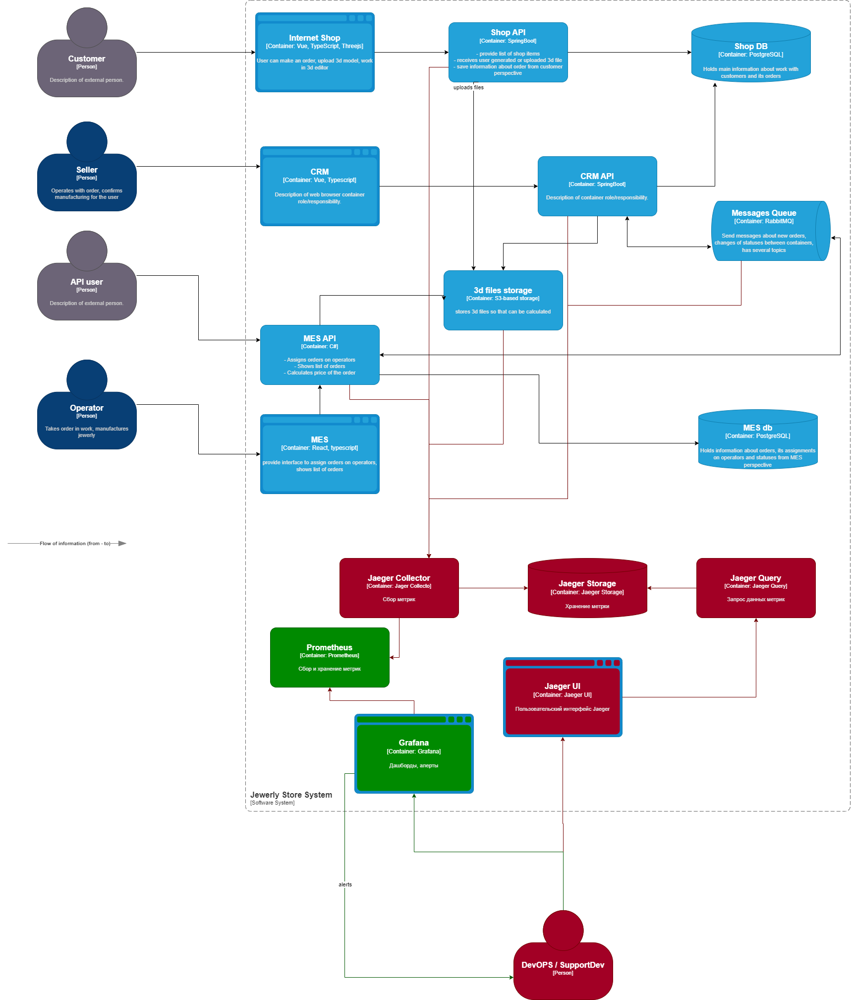

# Задача 3
## Архитектурное решение по трейсингу

### Мотивация
#### Проблемы
Компания сталкивается со следующими проблемами при работе с заказами:
- Заказы не отображаются в одном из сервисов: CRM API, Shop APi, MES API
- Не консистентность данных о заказе между сервисами
- Потеря файлов заказа и ошибки при сохранении в 3d storage

#### Метрики
Метрики, на которые повлияет внедрение трейсинга:
- Технические метрики
  - Среднее время обнаружения ошибок (MTTD)
    - Ускорит обнаружение и определения ошибок 
  - Среднее время восстановления (MTTR)
    - Уменьшит время, за которое инцидент был разрешен 
  - Среднее время отклика по сервисам
    - Позволит уменьшить время отклика сервисов
  - % ошибок обработки (возвращенных) сообщений RabbitMQ по сервисам
    - Уменьшит ошибки при обмене сообщениями между сервисами
- Бизнес-метрики
  - % заказов, обработанных успешно
    - Увеличит количество, выполненных успешно заказов
  - Среднее время выполнения заказа
    - Ускорит выполнение заказов
  - SLA сервисов
    - Увеличит вреия доступности сервисов компании для клиентов

### Предлагаемое решение
Для трассировки будут использоваться OpenTelemetry и Jaeger
Для алертинга: Prometheus и Grafana

### Компромиссы
- Необходимость обучения команды взаимодействию и интеграции OpenTelemetry и Jaeger
- Проприетарные части сервисов могут требовать времени и усилий для интеграции, а также задержать разработку

### Предотвращение несанкционированного доступа
- Аутентификация
  - Доступ к Jaeger UI и Grafana с белых списков IP и авторизацию
- Защита данных
  - Сокрытие и хэширование чувствительных данных
  - Передача данных в зашифрованном виде
