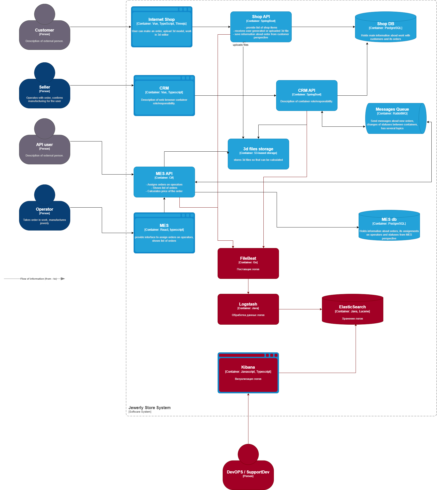

# Задача 4
## Архитектурное решение по логированию

### Планирование
Список логов для сбора
- INFO
  - Shop API
    - Заведение заказа: order_id, user_id, datetime
    - Загрузка файла: order_id, user_id, file_id, datetime
    - Создание заказа: order_id, user_id, datetime
  - MES API
    - Расчёт цены заказа: order_id, user_id, price, datetime
    - Передача заказа в работу: order_id, employee_id, datetime
    - Выполнение заказа: order_id, employee_id, datetime
    - Упаковка заказа: order_id, employee_id, datetime
    - Отправка заказа: order_id, employee_id, datetime
  - CRM API:
    - Закрытие заказа: order_id, employee_id, datetime
- WARNING
  - Shop API
    - Попытка повторного создания заказа: order_id, user_id, datetime
  - MES API
    - Попытка повторной передачи заказа в работу: order_id, employee_id, datetime
    - Попытка повторного выполнения заказа: order_id, employee_id, datetime
  - CRM API
    - Попытка закрытия закрытого заказа: order_id, employee_id, datetime
- ERROR
  - Shop API
    - Попытка создания дубля заказа: order_id, user_id, datetime
    - Ошибка при загрузке файла: order_id, user_id, file_id, datetime
  - MES API
    - Попытка передачи в работу выполненного заказа: order_id, employee_id, datetime

### Мотивация
Логирование позволит отследить бизнесу и разработчикам время выполнения этапов и на каких из них возникают ошибки, а также
действия пользователей и их расхождения с разработанной бизнес логикой

#### Метрики
- Бизнес
  - Количество обработанных заказов
  - Количество потерянных заказов
  - Успешность обработки заказов
  - Время обработки заказов
- Технические
  - Количество ошибок по этапам обработки
  - Частоту повторения ошибок
  - Время обработки по этапам

### Предлагаемое решение

#### Технологии
- Filebeat - сборщик логов.
- Logstash - Обработка логов для ElasticSearch.
- ElasticSearch / OpenSearch - хранение логов 
- Kibana - Визуализация логов

#### Политика хранения
- DEBUG
  - 7 дней
  - Кратковременные логи для тестирования новых фич
- INFO
  - 3 месяца
  - Среднесрочные логи для анализа работы бизнес-логики и действий пользователей
- WARN
  - 6 месяцев
  - Долгосрочные логи для анализа потенциального ошибочного поведения сервисов на длинной дистанции
- ERROR
  - 12 месяцев
  - Долгосрочные логи для анализа ошибок, частоты их повторения и определение причин ошибочного поведения на длинной 
дистанции

#### Политика безопасности
Правила:
- Маскировать или хешировать чувствительные данные
- Не логировать данные авторизации (токены, пароли)
- Не логировать персональные данные

Доступ:
- Разработчики: полный доступ на чтение
- DevOps: полны доступ на чтение + настройку
- Сотрудники техподдержки: ограниченные доступ на чтение по правилам фильтрации

### Анализ логов и алертинг
- Настроить анализ частоты ошибок по этапам обработки заказа
- Настроить алерты на почту, в telegram при повышении частоты ошибок
- Открывать задачи в jira при повышении частоты ошибок

