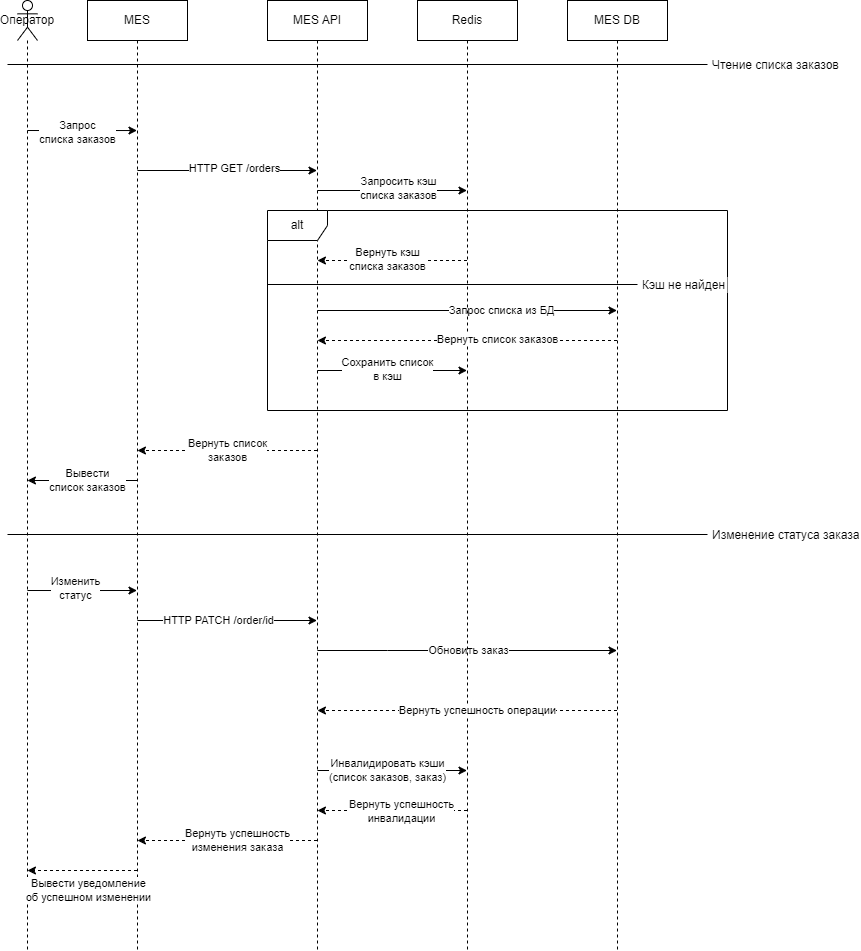

# Задача 5
## Архитектурное решение по кешированию

### Мотивация
Внедрение системы кэширования позволить решить следующие проблемы:
- Долгая загрузка страницы заказов
- Скорость работы выполнения заказа
- Уменьшение нагрузки на БД
- Уменьшение негатива от пользователей

### Предполагаемое решение
#### Тип кэширования
Для решения проблем было выбрано серверное кэширование Cache Aside, которое довольно просто реализовать, учитывая
маленькую команду разработчиков и потенциальную необходимость повышения квалификации

Отказ от клиентское кэширования обусловлен тем, что его трудно контролировать, оно может привести к неожиданным ошибкам и
высоки затраты на его реализацию

#### Паттерн кэширования
Выбран паттерн Cache Aside, самый простой в реализации и позволяющий быстро решить проблемы. В дальнейшем после
найма сотрудников и повышения квалификации возможен переход к более сложным паттернам

#### Стратегия инвалидации кэша
| Стратегия                            | Можно использовать | Комментарий                                                                               |
|--------------------------------------|--------------------|-------------------------------------------------------------------------------------------|
| Временная инвалидация                | Да (как fallback)  | Простая реализация, возможны проблемы с актуальностью данных                              |
| Инвалидация, основанная на запросах	 | Нет                | MES пользуются операторы, а не простые пользователи, нельзя ориентироваться на активность |
| Инвалидация на основе изменений      | Нет                | Реализация средней сложности                                                              |
| Программная инвалидация              | Да                 | Гибкость, сложность реализации может варьироваться                                        |
| Инвалидация по ключу                 | Нет                | Простая реализация, обновление данных по ключам, но нет сбрасывает кэш списка заказов     |

Для внедрения кэширования выбраны две стратегии:
- Программная инвалидация - основаная стратегия, которая позволит инвалидировать кэш на основе событий
- Временная инвалидация - дополнительная страгения, которую просто реализовать и она будет прикрывать ошибки основной 
стратегии

#### Диаграмма
